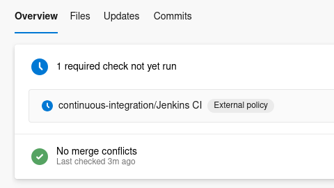

# Jenkins Azure DevOps Connector

This project integrates pipelines running on an isolated Jenkins instance with Azure DevOps repositories and pull requests.



It synchronizes Jenkins pipeline results with Azure DevOps commits and pull requests by publishing pipeline statuses as additional commit and pull request statuses.

These statuses can be used by Azure DevOps as pull request completion checks, ensuring that a pull request cannot be completed until the associated Jenkins pipeline has finished successfully.


## Installation

**Recommended installation:** Use the Docker image with Docker Compose.

**Alternative:** Build and run the application from source.

> **⚠️ Important**
> This application must run as a standalone service that is continuously available. For proper synchronization between Jenkins and Azure DevOps, it should be running **24/7**.
>
> Ensure that:
>
> * Jenkins can send requests to the service.
> * The service can communicate with Azure DevOps.

## Configuration

The application requires a small amount of configuration in both Jenkins and Azure DevOps.

On the Jenkins side, pipelines must notify the application whenever their execution state changes. On the Azure DevOps side, the application requires credentials with permission to publish commit and pull request statuses.

### Jenkins

Pipelines whose build status should be reflected in Azure DevOps must notify the application whenever their execution state changes.

#### Declarative Pipeline

For Declarative Pipelines, add the following `post` block to your `Jenkinsfile`:

```groovy
pipeline {
  agent any

  stages {
    stage('First stage') {
      steps {
        script {
          notify('started')
        }

        echo 'Building...'
      }
    }
  }
  post {
    success {
      script {
        notify('success')
      }
    }
    unsuccessful {
      script {
        notify('failure')
      }
    }
    aborted {
      script {
        notify('aborted')
      }
    }
  }
}

...

def notify(status) {
  def payload = """
  {
    "job": "${env.JOB_NAME}",
    "build": ${env.BUILD_NUMBER},
    "commit": "${env.GIT_COMMIT}",
    "branch": "${env.BRANCH_NAME}",
    "gitUrl": "${env.GIT_URL}",
    "status": "${status}",
    "buildUrl": "${env.BUILD_URL}"
  }
  """

  try {
    httpRequest(
      httpMode: 'POST',
      url: 'https://your-service.example.com/api/v1/job-events',
      contentType: 'APPLICATION_JSON',
      requestBody: payload
    )
  } catch (Exception e) {
    echo "Failed to notify Jenkins-DevOps connector: ${e.message}"
  }
}
```

> **Note**
>
> * `notify('started')` needs to be invoked in the **first** stage
> * notifications are **best-effort only** to prevent declaring entire pipeline failure in case Jenkins _cannot_ notify the connector

#### Scripted Pipeline

For Scripted Pipelines, invoke the same `notify(status)` helper at the appropriate points in your pipeline (for example when the build starts, succeeds, fails, or is aborted). The notification mechanism is identical—the only difference is where the calls are placed.

> **Note**
>
> * Replace `https://your-service.example.com/` with the URL where this application is deployed.
> * The Jenkins **HTTP Request Plugin** must be installed.

### Azure DevOps

The application authenticates using an Azure DevOps user account and a Personal Access Token (PAT). The account must have permission to update commit and pull request statuses for the target repositories.

Configure the PAT either directly in `docker-compose.yaml` or by using an `.env` file:

```sh
AZURE_PAT=your-personal-access-token
```

> **Note**
>
> The Azure DevOps user must have **Contributor** permissions on the target repositories.

#### Configure a status check

To display Jenkins pipeline results in pull requests (and optionally require successful builds before merging), configure a custom status check for each protected branch:

1. Go to **Project Settings**.
2. Select **Repositories**, then choose the target repository.
3. Open **Branch policies** and select the target branch (typically `main`, `master`, or `dev`).
4. Under **Status checks**, select **Add status policy**.
5. Enable **Enter genre/name separately** and configure:

   * **Genre:** `continuous-integration`
   * **Name:** `Jenkins CI`
6. Under **Advanced**, configure as desired:

   * **Authorized identity:** Restrict to the Azure DevOps user used by this application (recommended).
   * **Reset conditions:** Configure according to your workflow.
   * **Path filter:** Leave empty unless needed.
   * **Policy applicability:** `Apply by default`.

Optionally, mark the status policy as **Required** to prevent pull requests from being completed until the Jenkins pipeline reports a successful status.

